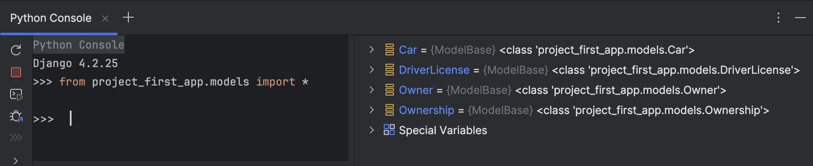
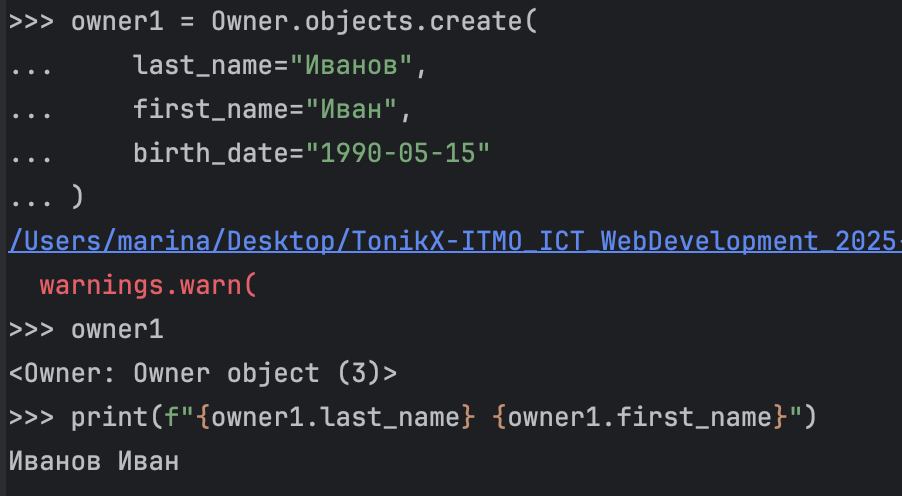
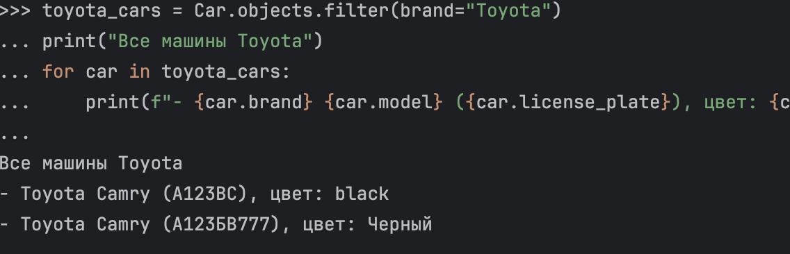
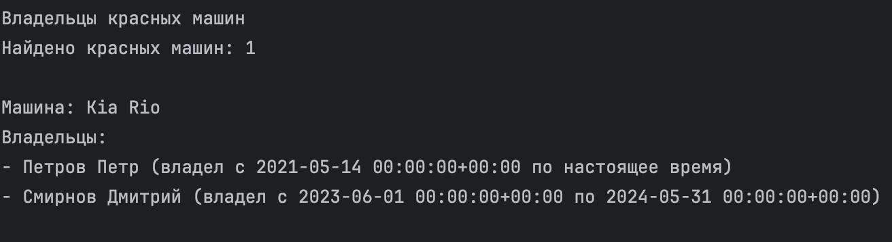
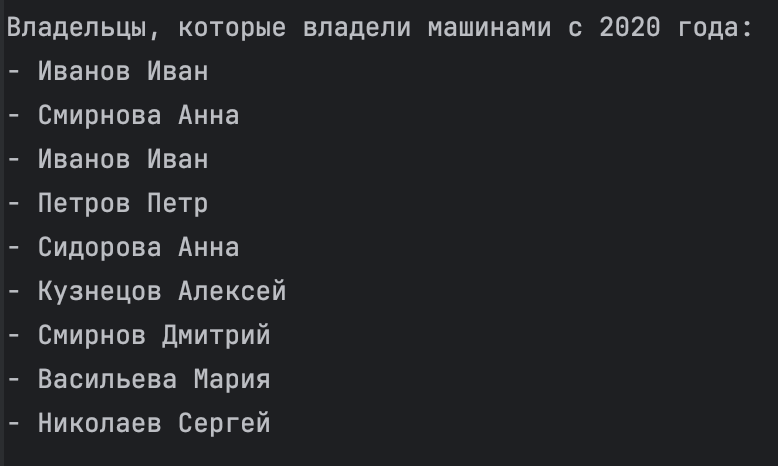
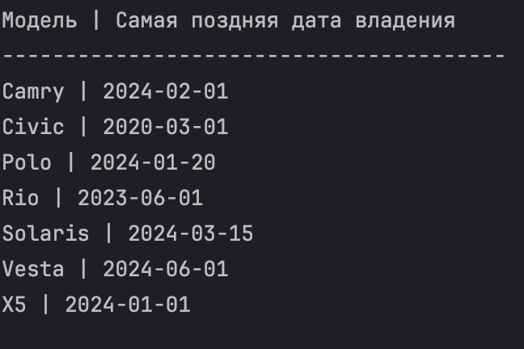
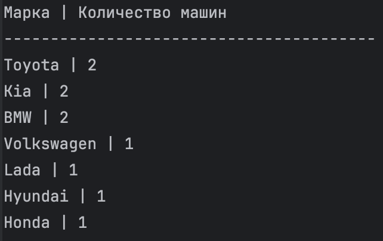

# Практическая работа 3.1
## Django Web framework. Запросы и их выполнение.
***
**Автор:** Машковцева Марина
***

### Практическое задание 1
Напишите запрос на создание 6-7 новых автовладельцев и 5-6 автомобилей, каждому автовладельцу назначьте удостоверение и от 1 до 3 автомобилей. Задание можете выполнить либо в интерактивном режиме интерпретатора, либо в отдельном python-файле. Результатом должны стать запросы и отображение созданных объектов. 
### Выполнение:
1. Сначала я открыла Python Console и импортировала классы моделей приложения:
    
2. Затем создала объекты, а именно 7 владельцев, 6 авто, 7 прав для каждого водителя. Выглядит это так:
    
    Предупреждение появляется, потому что я не вводила время, а ограничилась только датой. На работу это никак не повлияло кроме такого предупреждения.
    Полный список всех созданных объектов:
    **Владельцы:**
   ```python
    owner1 = Owner.objects.create(
        last_name="Иванов",
        first_name="Иван",
        birth_date="1990-05-15"
    )
    
    owner2 = Owner.objects.create(
        last_name="Петров",
        first_name="Петр",
        birth_date="1985-08-22"
    )
    
    owner3 = Owner.objects.create(
        last_name="Сидорова",
        first_name="Анна",
        birth_date="1995-02-10"
    )
    
    owner4 = Owner.objects.create(
        last_name="Кузнецов",
        first_name="Алексей",
        birth_date="1988-11-30"
    )
    
    owner5 = Owner.objects.create(
        last_name="Смирнов",
        first_name="Дмитрий",
        birth_date="1992-07-18"
    )
    
    owner6 = Owner.objects.create(
        last_name="Васильева",
        first_name="Мария",
        birth_date="1998-03-25"
    )
    
    owner7 = Owner.objects.create(
        last_name="Николаев",
        first_name="Сергей",
        birth_date="1980-12-05"
    )
    ```
   **Автомобили:**
   ```python
    car1 = Car.objects.create(
        license_plate="А123БВ777",
        brand="Toyota",
        model="Camry",
        color="Черный"
    )
    
    car2 = Car.objects.create(
        license_plate="В456ГД123",
        brand="BMW",
        model="X5",
        color="Белый"
    )
    
    car3 = Car.objects.create(
        license_plate="Е789ЖК456",
        brand="Lada",
        model="Vesta",
        color="Серый"
    )
    
    car4 = Car.objects.create(
        license_plate="М012НО789",
        brand="Kia",
        model="Rio",
        color="Красный"
    )
    
    car5 = Car.objects.create(
        license_plate="П345РС012",
        brand="Hyundai",
        model="Solaris",
        color="Синий"
    )
    
    car6 = Car.objects.create(
        license_plate="Т678УФ345",
        brand="Volkswagen",
        model="Polo",
        color="Зеленый"
    )
    ```
   И **водительское удостоверение** для каждого водителя:
    ```python
    DriverLicense.objects.create(
        owner=owner1,
        license_number="1234567890",
        license_type="B",
        issue_date="2015-06-10"
    )
    
    DriverLicense.objects.create(
        owner=owner2,
        license_number="2345678901",
        license_type="BC",
        issue_date="2010-09-15"
    )
    
    DriverLicense.objects.create(
        owner=owner3,
        license_number="3456789012",
        license_type="B",
        issue_date="2018-03-22"
    )
    
    DriverLicense.objects.create(
        owner=owner4,
        license_number="4567890123",
        license_type="BCD",
        issue_date="2009-11-05"
    )
    
    DriverLicense.objects.create(
        owner=owner5,
        license_number="5678901234",
        license_type="B",
        issue_date="2016-07-30"
    )
    
    DriverLicense.objects.create(
        owner=owner6,
        license_number="6789012345",
        license_type="B",
        issue_date="2020-01-18"
    )
    
    DriverLicense.objects.create(
        owner=owner7,
        license_number="7890123456",
        license_type="BCDE",
        issue_date="2005-08-12"
    )
   ```
4. Далее связываю автомобили с владельцами через модель Ownership
    ```python
    # Владелец 1 получает 2 автомобиля
    Ownership.objects.create(
        owner=owner1,
        car=car1,
        start_date="2020-01-15",
        end_date="2023-12-31"
    )
    
    Ownership.objects.create(
        owner=owner1,
        car=car2,
        start_date="2022-03-10",
        end_date=None  # еще владеет
    )
    
    # Владелец 2 получает 3 автомобиля
    Ownership.objects.create(
        owner=owner2,
        car=car2,  # BMW X5 перешел от owner1 к owner2
        start_date="2024-01-01",
        end_date=None
    )
    
    Ownership.objects.create(
        owner=owner2,
        car=car3,
        start_date="2019-08-20",
        end_date=None
    )
    
    Ownership.objects.create(
        owner=owner2,
        car=car4,
        start_date="2021-05-14",
        end_date=None
    )
    
    # Владелец 3 получает 1 автомобиль
    Ownership.objects.create(
        owner=owner3,
        car=car5,
        start_date="2023-02-28",
        end_date=None
    )
    
    # Владелец 4 получает 2 автомобиля
    Ownership.objects.create(
        owner=owner4,
        car=car1,  # Toyota Camry перешла от owner1
        start_date="2024-01-01",
        end_date=None
    )
    
    Ownership.objects.create(
        owner=owner4,
        car=car6,
        start_date="2022-11-11",
        end_date=None
    )
    
    # Владелец 5 получает 2 автомобиля
    Ownership.objects.create(
        owner=owner5,
        car=car4,  # Kia Rio перешла от owner2
        start_date="2023-06-01",
        end_date="2024-05-31"
    )
    
    Ownership.objects.create(
        owner=owner5,
        car=car3,  # Lada Vesta перешла от owner2
        start_date="2024-06-01",
        end_date=None
    )
    
    # Владелец 6 получает 1 автомобиль
    Ownership.objects.create(
        owner=owner6,
        car=car5,  # Hyundai Solaris перешел от owner3
        start_date="2024-03-15",
        end_date=None
    )
    
    # Владелец 7 получает 3 автомобиля
    Ownership.objects.create(
        owner=owner7,
        car=car1,  # Toyota Camry перешла от owner4
        start_date="2024-02-01",
        end_date=None
    )
    
    Ownership.objects.create(
        owner=owner7,
        car=car2,  # BMW X5 перешел от owner2
        start_date="2023-12-01",
        end_date=None
    )
    
    Ownership.objects.create(
        owner=owner7,
        car=car6,  # Volkswagen Polo перешел от owner4
        start_date="2024-01-20",
        end_date=None
    )
   ```
   5. После проверяю все получившиеся данные:
   ```markdown
    Владельцев создано: 9
    Автомобилей создано: 10
    Удостоверений создано: 7
    Записей о владении создано: 20
    === Все владельцы и их автомобили ===
    Владелец: Иванов Иван
    Автомобили:
      - Toyota Camry (A123BC)
        Период владения: 2020-01-01 00:00:00+00:00 - 2021-01-01 00:00:00+00:00
        - BMW X5 (B456CD)
          Период владения: 2021-01-02 00:00:00+00:00 - 2022-05-10 00:00:00+00:00
        - Kia Rio (C789EF)
          Период владения: 2022-05-11 00:00:00+00:00 - 2023-10-15 00:00:00+00:00
    Владелец: Смирнова Анна
    Автомобили:
        - Honda Civic (D111GH)
          Период владения: 2020-03-01 00:00:00+00:00 - 2021-05-01 00:00:00+00:00
        - Toyota Camry (A123BC)
          Период владения: 2021-05-02 00:00:00+00:00 - 2022-06-15 00:00:00+00:00
        - BMW X5 (B456CD)
          Период владения: 2022-06-16 00:00:00+00:00 - 2023-12-31 00:00:00+00:00
    Владелец: Иванов Иван
    Автомобили:
        - Toyota Camry (А123БВ777)
          Период владения: 2020-01-15 00:00:00+00:00 - 2023-12-31 00:00:00+00:00
        - BMW X5 (В456ГД123)
          Период владения: 2022-03-10 00:00:00+00:00 - настоящее время
    Владелец: Петров Петр
    Автомобили:
        - BMW X5 (В456ГД123)
          Период владения: 2024-01-01 00:00:00+00:00 - настоящее время
        - Lada Vesta (Е789ЖК456)
          Период владения: 2019-08-20 00:00:00+00:00 - настоящее время
        - Kia Rio (М012НО789)
          Период владения: 2021-05-14 00:00:00+00:00 - настоящее время
    Владелец: Сидорова Анна
    Автомобили:
        - Hyundai Solaris (П345РС012)
          Период владения: 2023-02-28 00:00:00+00:00 - настоящее время
    Владелец: Кузнецов Алексей
    Автомобили:
        - Toyota Camry (А123БВ777)
          Период владения: 2024-01-01 00:00:00+00:00 - настоящее время
        - Volkswagen Polo (Т678УФ345)
          Период владения: 2022-11-11 00:00:00+00:00 - настоящее время
    Владелец: Смирнов Дмитрий
    Автомобили:
        - Kia Rio (М012НО789)
          Период владения: 2023-06-01 00:00:00+00:00 - 2024-05-31 00:00:00+00:00
        - Lada Vesta (Е789ЖК456)
          Период владения: 2024-06-01 00:00:00+00:00 - настоящее время
    Владелец: Васильева Мария
    Автомобили:
        - Hyundai Solaris (П345РС012)
          Период владения: 2024-03-15 00:00:00+00:00 - настоящее время
    Владелец: Николаев Сергей
    Автомобили:
        - Toyota Camry (А123БВ777)
          Период владения: 2024-02-01 00:00:00+00:00 - настоящее время
        - BMW X5 (В456ГД123)
          Период владения: 2023-12-01 00:00:00+00:00 - настоящее время
        - Volkswagen Polo (Т678УФ345)
          Период владения: 2024-01-20 00:00:00+00:00 - настоящее время
    === Все автомобили и их владельцы ===
    Автомобиль: Toyota Camry (A123BC)
    Владельцы (в хронологическом порядке):
        - Смирнова Анна
          Период владения: 2021-05-02 00:00:00+00:00 - 2022-06-15 00:00:00+00:00
        - Иванов Иван
          Период владения: 2020-01-01 00:00:00+00:00 - 2021-01-01 00:00:00+00:00
    Автомобиль: BMW X5 (B456CD)
    Владельцы (в хронологическом порядке):
        - Смирнова Анна
          Период владения: 2022-06-16 00:00:00+00:00 - 2023-12-31 00:00:00+00:00
        - Иванов Иван
          Период владения: 2021-01-02 00:00:00+00:00 - 2022-05-10 00:00:00+00:00
    Автомобиль: Kia Rio (C789EF)
    Владельцы (в хронологическом порядке):
        - Иванов Иван
          Период владения: 2022-05-11 00:00:00+00:00 - 2023-10-15 00:00:00+00:00
    Автомобиль: Honda Civic (D111GH)
    Владельцы (в хронологическом порядке):
        - Смирнова Анна
          Период владения: 2020-03-01 00:00:00+00:00 - 2021-05-01 00:00:00+00:00
    Автомобиль: Toyota Camry (А123БВ777)
    Владельцы (в хронологическом порядке):
        - Николаев Сергей
          Период владения: 2024-02-01 00:00:00+00:00 - настоящее время
        - Кузнецов Алексей
          Период владения: 2024-01-01 00:00:00+00:00 - настоящее время
        - Иванов Иван
          Период владения: 2020-01-15 00:00:00+00:00 - 2023-12-31 00:00:00+00:00
    Автомобиль: BMW X5 (В456ГД123)
    Владельцы (в хронологическом порядке):
        - Петров Петр
          Период владения: 2024-01-01 00:00:00+00:00 - настоящее время
        - Николаев Сергей
          Период владения: 2023-12-01 00:00:00+00:00 - настоящее время
        - Иванов Иван
          Период владения: 2022-03-10 00:00:00+00:00 - настоящее время
    Автомобиль: Lada Vesta (Е789ЖК456)
    Владельцы (в хронологическом порядке):
        - Смирнов Дмитрий
          Период владения: 2024-06-01 00:00:00+00:00 - настоящее время
        - Петров Петр
          Период владения: 2019-08-20 00:00:00+00:00 - настоящее время
    Автомобиль: Kia Rio (М012НО789)
    Владельцы (в хронологическом порядке):
        - Смирнов Дмитрий
          Период владения: 2023-06-01 00:00:00+00:00 - 2024-05-31 00:00:00+00:00
        - Петров Петр
          Период владения: 2021-05-14 00:00:00+00:00 - настоящее время
    Автомобиль: Hyundai Solaris (П345РС012)
    Владельцы (в хронологическом порядке):
        - Васильева Мария
          Период владения: 2024-03-15 00:00:00+00:00 - настоящее время
        - Сидорова Анна
          Период владения: 2023-02-28 00:00:00+00:00 - настоящее время
    Автомобиль: Volkswagen Polo (Т678УФ345)
    Владельцы (в хронологическом порядке):
        - Николаев Сергей
          Период владения: 2024-01-20 00:00:00+00:00 - настоящее время
        - Кузнецов Алексей
          Период владения: 2022-11-11 00:00:00+00:00 - настоящее время
    === Водительские удостоверения ===
    Владелец: Иванов Иван
        Номер удостоверения: 1234567890
        Категория: B
        Дата выдачи: 2015-06-10 00:00:00+00:00
    Владелец: Петров Петр
        Номер удостоверения: 2345678901
        Категория: BC
        Дата выдачи: 2010-09-15 00:00:00+00:00
    Владелец: Сидорова Анна
        Номер удостоверения: 3456789012
        Категория: B
        Дата выдачи: 2018-03-22 00:00:00+00:00
    Владелец: Кузнецов Алексей
        Номер удостоверения: 4567890123
        Категория: BCD
        Дата выдачи: 2009-11-05 00:00:00+00:00
    Владелец: Смирнов Дмитрий
        Номер удостоверения: 5678901234
        Категория: B
        Дата выдачи: 2016-07-30 00:00:00+00:00
    Владелец: Васильева Мария
        Номер удостоверения: 6789012345
        Категория: B
        Дата выдачи: 2020-01-18 00:00:00+00:00
    Владелец: Николаев Сергей
        Номер удостоверения: 7890123456
        Категория: BCDE
        Дата выдачи: 2005-08-12 00:00:00+00:00
   ```
### Практическое задание 2
По созданным в пр.1 данным написать следующие запросы на фильтрацию:

- Где это необходимо, добавьте related_name к полям модели
- Выведете все машины марки “Toyota” (или любой другой марки, которая у вас есть)
- Найти всех водителей с именем “Олег” (или любым другим именем на ваше усмотрение)
- Взяв любого случайного владельца получить его id, и по этому id получить экземпляр удостоверения в виде объекта модели (можно в 2 запроса)
- Вывести всех владельцев красных машин (или любого другого цвета, который у вас присутствует)
- Найти всех владельцев, чей год владения машиной начинается с 2010 (или любой другой год, который присутствует у вас в базе)

Выполнение:
1. Сначала я добавила ```related_name``` в модели Ownership, DriverLicense
2. Затем применила миграции (```python manage.py makemigrations```, ```python manage.py migrate```):
    
3. И теперь снова можно переходить в Python Console и выполнять запросы. Далее я буду оформлять их дополнительными выводами через print, чтобы было точно понятно что конкретно выводит данный запрос
4. Вывести все машины марки "Toyota":
   ```python
    toyota_cars = Car.objects.filter(brand="Toyota")
    print(Все машины Toyota")
    for car in toyota_cars:
        print(f"- {car.brand} {car.model} ({car.license_plate}), цвет: {car.color}")
    ```
    
5. Найти всех водителей с именем "Анна":
    ```python
    anna_owners = Owner.objects.filter(first_name="Анна")
    print("Все водители с именем Анна")
    for owner in anna_owners:
        print(f"- {owner.last_name} {owner.first_name}, дата рождения: {owner.birth_date}")
    ```
   
6. Взять случайного владельца и получить его удостоверение:
    ```python
    import random    
    # Первый запрос - получаем ID случайного владельца
    owner_ids = Owner.objects.values_list('id', flat=True)
    if owner_ids:
        random_id = random.choice(owner_ids)
        print(f"Случайный ID владельца: {random_id}")
        
        # Второй запрос - получаем удостоверение по этому ID
        try:
            license_by_id = DriverLicense.objects.get(owner_id=random_id)
            print(f"Удостоверение: {license_by_id.license_number}")
            print(f"Владелец: {license_by_id.owner.last_name} {license_by_id.owner.first_name}")
        except DriverLicense.DoesNotExist:
            print(f"У владельца с ID {random_id} нет удостоверения")
    ```
   
7. Вывести всех владельцев красных машин
    ```python
    print("Владельцы красных машин")
    
    # Сначала находим все красные машины
    red_cars = Car.objects.filter(color="Красный")
    print(f"Найдено красных машин: {red_cars.count()}")
    
    # Для каждой красной машины находим владельцев через Ownership
    for car in red_cars:
        print(f"\nМашина: {car.brand} {car.model}")
        
        # Получаем все записи о владении этой машиной
        ownerships = car.ownerships.all()  # используем related_name
        
        if ownerships.exists():
            print("Владельцы:")
            for ownership in ownerships:
                print(f"- {ownership.owner.last_name} {ownership.owner.first_name} (владел с {ownership.start_date} по {ownership.end_date or 'настоящее время'})")
        else:
            print("Нет записей о владении")
    ```
   
8. Найти всех владельцев, чей год владения машиной начинается с 2020
    ```python
    owners_since_2020 = Owner.objects.filter(
        ownerships__start_date__year__gte=2020 
    ).distinct()
    print("Владельцы, которые владели машинами с 2020 года:")
    for owner in owners_since_2020:
        print(f"- {owner.last_name} {owner.first_name}")
   ```
   

### Практическое задание 3
Необходимо реализовать следующие запросы c применением описанных методов:
- Вывод даты выдачи самого старшего водительского удостоверения
- Укажите самую позднюю дату владения машиной, имеющую какую-то из существующих моделей в вашей базе
- Выведите количество машин для каждого водителя
- Подсчитайте количество машин каждой марки
- Отсортируйте всех автовладельцев по дате выдачи удостоверения 

Выполнение:
1. Самая старая дата выдачи водительского удостоверения:
    ```python
    oldest_license_date = DriverLicense.objects.aggregate(
        oldest_date=Min('issue_date')
    )
    print(f"Самая старая дата выдачи: {oldest_license_date['oldest_date']}")
    ```
   
2. Самая поздняя дата владения машиной для каждой модели
    ```python
    latest_ownership_by_model = Ownership.objects.values(
        'car__model'
    ).annotate(
        latest_date=Max('start_date')
    ).order_by('car__model')
    
    print("Модель | Самая поздняя дата владения")
    print("-" * 40)
    for item in latest_ownership_by_model:
        print(f"{item['car__model']} | {item['latest_date'].date()}")
    ```
   
3. Количество машин для каждого водителя
    ```python
    owners_with_car_count = Owner.objects.annotate(
        car_count=Count('ownerships')
    ).order_by('-car_count')
    
    print("Владелец | Количество машин (всё время)")
    print("-" * 40)
    for owner in owners_with_car_count:
        print(f"{owner.last_name} {owner.first_name} | {owner.car_count}")
    ```
   
4. Количество машин каждой марки
    ```python
    cars_by_brand = Car.objects.values('brand').annotate(
        count=Count('id')
    ).order_by('-count')
    
    print("Марка | Количество машин")
    print("-" * 40)
    for item in cars_by_brand:
        print(f"{item['brand']} | {item['count']}")
    ```
   
5. Сортировка владельцев по дате выдачи удостоверения
   ```python
   owners_sorted_by_license = Owner.objects.filter(
       licenses__isnull=False
   ).annotate(
       license_date=Min('licenses__issue_date')
   ).order_by('license_date').distinct()
   
   print("Владелец | Дата выдачи удостоверения")
   print("-" * 40)
   for owner in owners_sorted_by_license:
       license = owner.licenses.order_by('issue_date').first()
       print(f"{owner.first_name} {owner.last_name} | {license.issue_date.date()}")
   ```
   
