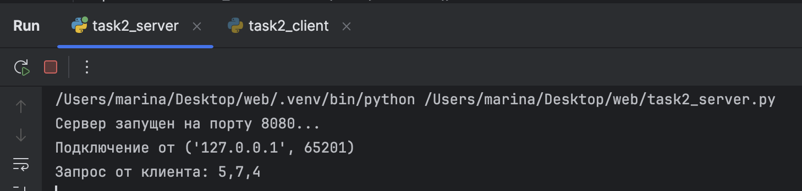
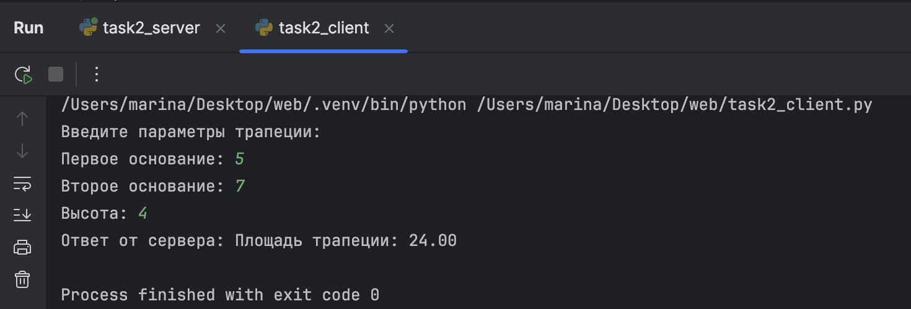

# Задание 2

## Условие
Реализовать клиентскую и серверную часть приложения.  
Клиент запрашивает выполнение математической операции, параметры которой вводятся с клавиатуры.  
Сервер обрабатывает данные и возвращает результат клиенту.  

**Варианты операций:**
1. Теорема Пифагора  
2. Решение квадратного уравнения  
3. Поиск площади трапеции  
4. Поиск площади параллелограмма  

Я в списке 19, значит мой вариант - 3 (Поиск площади трапеции). 

---

## Пояснения
- **TCP (Transmission Control Protocol)** — протокол передачи данных, который обеспечивает надёжную доставку сообщений (в отличие от UDP).  
- **Сокет (socket)** — программная «точка подключения» к сети. В TCP сокет устанавливает соединение клиент ↔ сервер и работает как «телефонный звонок».  

---

## Реализация

### Сервер
```python
import socket

# Создаем сокет
server_socket = socket.socket(socket.AF_INET, socket.SOCK_STREAM)  # IPv4, TCP
# Привязываем сокет к адресу и порту
server_socket.bind(('localhost', 8080))
# Слушаем входящие соединения
server_socket.listen(1)

print("Сервер запущен на порту 8080...")

while True:
    # Принимаем соединение от клиента
    client_connection, client_address = server_socket.accept()
    print(f'Подключение от {client_address}')

    # Получаем сообщение от клиента
    data = client_connection.recv(1024).decode()
    print(f'Запрос от клиента: {data}')

    # Разбираем данные и вычисляем площадь трапеции
    try:
        base1, base2, height = map(float, data.split(','))
        area = (base1 + base2) * height / 2
        response = f'Площадь трапеции: {area:.2f}'
    except:
        response = 'Ошибка: неверный формат данных'

    # Отправляем ответ клиенту
    client_connection.sendall(response.encode())

    # Закрываем соединение
    client_connection.close()
```
## Пояснение:
Сервер создаёт TCP-сокет и «слушает» порт 8080. Когда подключается клиент, сервер получает от него параметры трапеции (два основания и высоту). После этого вычисляет площадь по формуле
$$
S = \frac{(a + b) \cdot h}{2}
$$
и отправляет результат обратно клиенту. Если данные некорректны, возвращается сообщение об ошибке.
---
## Клиент
```python
import socket

# Создаем сокет
client_socket = socket.socket(socket.AF_INET, socket.SOCK_STREAM)  # IPv4, TCP

# Подключаемся к серверу
client_socket.connect(('localhost', 8080))

# Получаем данные от пользователя
print("Введите параметры трапеции:")
base1 = input("Первое основание: ")
base2 = input("Второе основание: ")
height = input("Высота: ")

# Формируем и отправляем сообщение серверу
message = base1 + ',' + base2 + ',' + height
client_socket.sendall(message.encode())

# Получаем ответ от сервера
response = client_socket.recv(1024).decode()
print(f'Ответ от сервера: {response}')

# Закрываем соединение
client_socket.close()
```
## Пояснение:
Клиент создаёт TCP-сокет и подключается к серверу на `localhost:8080`.
Пользователь вводит параметры трапеции с клавиатуры. Клиент формирует строку вида **"a,b,h"** и отправляет её серверу. 
После получения ответа с результатом программа выводит его на экран и закрывает соединение.
---
## Скрины выполнения
### Вывод на стороне сервера


### Вывод на стороне клиента

