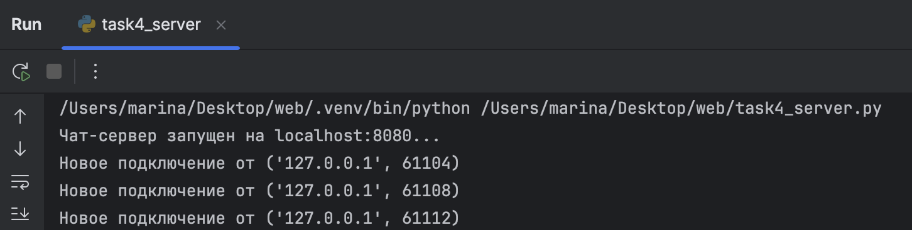
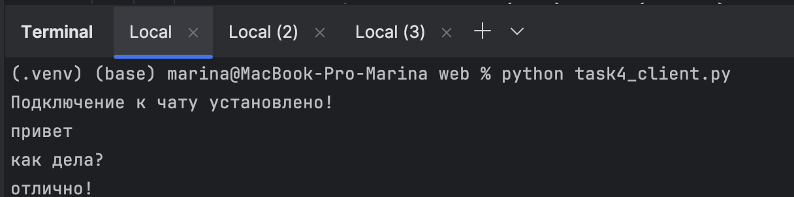
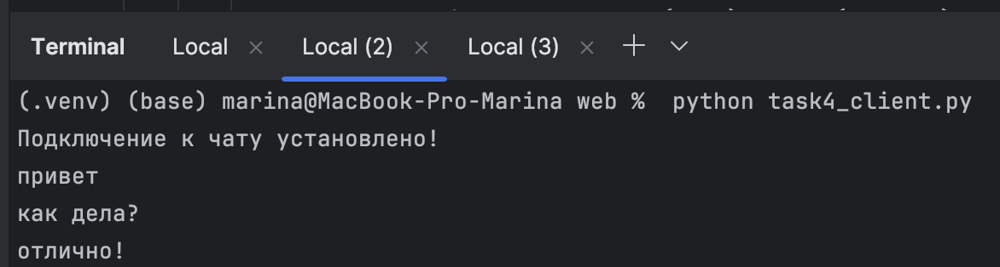
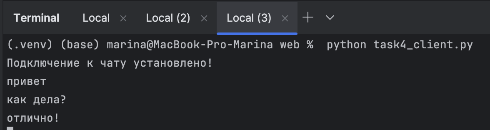

# Задание 4
---
## Условие
Реализовать двухпользовательский или многопользовательский чат.  
Для максимального количества баллов рекомендуется реализовать многопользовательский чат.  

**Требования:**  
- Обязательно использовать библиотеку `socket`.  
- Для многопользовательского чата использовать библиотеку `threading`.  
- Сервер должен обрабатывать подключения всех пользователей и пересылать сообщения между ними.

---

## Пояснения
- **TCP (Transmission Control Protocol)** — обеспечивает надёжную передачу сообщений между клиентом и сервером.  
- **Сокет (socket)** — точка подключения к сети, через которую происходит обмен сообщениями.  
- **Threading** — позволяет серверу одновременно обслуживать несколько клиентов.  

---

## Реализация

### Сервер
```python
import socket
import threading

# Настройки сервера
HOST = 'localhost'
PORT = 8080

# Создаем TCP-сокет
server_socket = socket.socket(socket.AF_INET, socket.SOCK_STREAM)
server_socket.bind((HOST, PORT))
server_socket.listen(5)

print(f"Чат-сервер запущен на {HOST}:{PORT}...")

# Список для хранения всех подключенных клиентов
clients = []


def handle_client(client):
    """Обрабатывает сообщения от конкретного клиента"""
    while True:
        try:
            # Получаем сообщение от клиента
            message = client.recv(1024).decode('utf-8')

            if message:
                # Рассылаем сообщение всем клиентам
                for client_item in clients:
                    if client_item != client:  # Не отправляем отправителю
                        client_item.send(message.encode('utf-8'))
            else:
                # Пустое сообщение = отключение
                break

        except:
            # Ошибка при получении = отключение
            break

    # Удаляем клиента при отключении
    if client in clients:
        clients.remove(client)
    client.close()


# Принимаем новые подключения
while True:
    # Принимаем новое подключение
    client_connection, client_address = server_socket.accept()
    print(f"Новое подключение от {client_address}")

    # Добавляем клиента в список
    clients.append(client_connection)

    # Создаем поток для общения с этим клиентом
    client_thread = threading.Thread(target=handle_client, args=(client_connection,))
    client_thread.daemon = True # Делаем поток фоновым (завершится вместе с сервером)
    client_thread.start() # Запускаем поток
```
## Пояснение:
- Сервер создаёт TCP-сокет и слушает заданный порт (`8080`).  
- При подключении нового клиента сервер добавляет его в список `clients`.  
- Для каждого клиента создаётся отдельный поток (`threading.Thread`), который обрабатывает сообщения этого клиента.  
- Когда клиент отправляет сообщение, сервер пересылает его всем остальным клиентам, кроме отправителя.  
- Если клиент отключается или возникает ошибка, поток закрывается, а клиент удаляется из списка.  
---
## Клиент
```python
import socket
import threading

# Настройки сервера
HOST = 'localhost'
PORT = 8080

# Создаем TCP-сокет и подключаемся к серверу
client_socket = socket.socket(socket.AF_INET, socket.SOCK_STREAM)
client_socket.connect((HOST, PORT))

print("Подключение к чату установлено!")


def receive_messages():
    """Получает сообщения от сервера в отдельном потоке"""
    while True:
        try:
            # Получаем сообщение от сервера
            message = client_socket.recv(1024).decode('utf-8')
            print(message)
        except:
            # Ошибка при получении = разрыв соединения
            print("Соединение разорвано!")
            break


# Поток для получения сообщений от сервера
receive_thread = threading.Thread(target=receive_messages)
receive_thread.daemon = True # Фоновый режим (завершится с программой)
receive_thread.start() # Запускаем прием сообщений

# Отправляем сообщения на сервер
while True:
    message = input()

    if message.lower() == 'выход':
        break

    # Отправляем сообщение на сервер
    try:
        client_socket.send(message.encode('utf-8'))
    except:
        print("Не удалось отправить сообщение!")
        break

client_socket.close()
```

## Пояснение:
- Запускаем несколько клиентов из разных терминалов, написав `python task4_client.py`
- Клиент создаёт TCP-сокет и подключается к серверу.  
- Создаётся отдельный поток для приёма сообщений от сервера, чтобы пользователь мог одновременно отправлять сообщения и получать их от других участников.  
- Пользователь вводит сообщения с клавиатуры. Все сообщения отправляются на сервер.  
- Команда `выход` завершает работу клиента и закрывает соединение.  
---
## Скрины выполнения
### Вывод на стороне сервера

### Вывод на стороне клиентов


