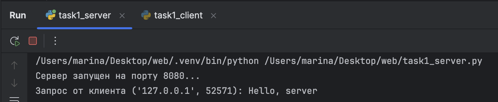
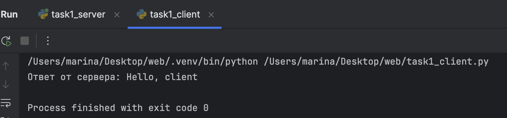

# Задание 1
---
## Условие
Реализовать клиентскую и серверную часть приложения.  
Клиент отправляет серверу сообщение **«Hello, server»**, и оно должно отобразиться на стороне сервера.  
В ответ сервер отправляет клиенту сообщение **«Hello, client»**, которое должно отобразиться у клиента.  

---

## Пояснения
- **Сокет (socket)** — программная «точка соединения», через которую приложения обмениваются данными по сети.  
- **UDP (User Datagram Protocol)** — протокол передачи данных без установки соединения. Он быстрый, но не гарантирует доставку сообщений.  

---

## Реализация

### Сервер
```python
import socket

# Создаем сокет (IPv4, UDP)
server_socket = socket.socket(socket.AF_INET, socket.SOCK_DGRAM)

# Привязываем сокет к адресу и порту
server_socket.bind(('localhost', 8080))

print("Сервер запущен на порту 8080...")

while True:
    # Получаем сообщение от клиента
    data, client_address = server_socket.recvfrom(1024)
    request = data.decode()
    print(f'Запрос от клиента {client_address}: {request}')

    # Отправляем ответ клиенту
    response = 'Hello, client'
    server_socket.sendto(response.encode(), client_address)
```
## Пояснение:
Сервер создаёт UDP-сокет и привязывает его к адресу `localhost:8080`.
Он постоянно ждёт сообщения от клиентов. 
Как только клиент отправляет строку, сервер принимает её, выводит на экран и отправляет в ответ сообщение **"Hello, client"**.
---
## Клиент
```python
import socket

# Создаем сокет (IPv4, UDP)
client_socket = socket.socket(socket.AF_INET, socket.SOCK_DGRAM)

# Указываем адрес сервера
server_address = ('localhost', 8080)

# Отправляем сообщение серверу
client_socket.sendto(b'Hello, server', server_address)

# Получаем ответ от сервера
response, server_addr = client_socket.recvfrom(1024)
print(f'Ответ от сервера: {response.decode()}')

# Закрываем соединение
client_socket.close()
```
## Пояснение
Клиент создаёт UDP-сокет и подключается к серверу на `localhost:8080`.
Он отправляет строку **"Hello, server"**, затем ждёт ответа от сервера. 
Когда сервер отвечает, клиент принимает сообщение **"Hello, client"** и выводит его на экран. 
После этого соединение закрывается.
---
## Скрины выполнения
### Вывод на стороне сервера


### Вывод на стороне клиента
