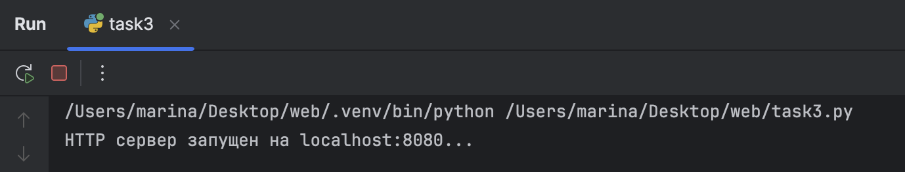
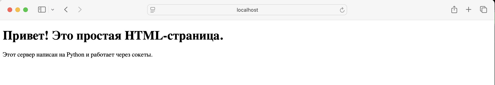

# Задание 3
---
## Условие
Реализовать серверную часть приложения.  
Клиент подключается к серверу, и в ответ получает HTTP-сообщение, содержащее HTML-страницу, которую сервер подгружает из файла `index.html`.  

**Требования:**  
- Обязательно использовать библиотеку `socket`.  
- Сервер должен корректно формировать HTTP-заголовки и отправлять содержимое файла клиенту.  

---

## Пояснения
- **HTTP (HyperText Transfer Protocol)** — протокол передачи данных для веб-страниц.  
- **Сокет (socket)** — программная точка подключения к сети, через которую сервер и клиент обмениваются данными.  
- Сервер получает HTTP-запрос, считывает HTML-файл и возвращает его клиенту с корректными заголовками.

---

## Реализация

### Сервер
```python
import socket

# Параметры сервера
HOST = 'localhost'  # Адрес хоста (localhost для локальных соединений)
PORT = 8080         # Порт, на котором будет работать сервер

# Создаем сокет
server_socket = socket.socket(socket.AF_INET, socket.SOCK_STREAM)

# Привязываем сокет к адресу и порту
server_socket.bind((HOST, PORT))

# Начинаем слушать входящие соединения
server_socket.listen(5)
print(f"HTTP сервер запущен на {HOST}:{PORT}...")

while True:
    # Принимаем соединение от клиента
    client_connection, client_address = server_socket.accept()
    print(f'Подключение от {client_address}')

    # Получаем запрос от клиента
    request = client_connection.recv(1024).decode('utf-8')
    print(f'Запрос клиента:\n{request}')

    try:
        # Читаем HTML-файл в бинарном режиме, чтобы избежать проблем с кодировкой
        with open('index.html', 'rb') as file:
            html_content = file.read()
    except FileNotFoundError:
        # Если файл не найден, используем страницу с ошибкой
        html_content = """
        <!DOCTYPE html>
        <html>
        <head>
            <title>Ошибка</title>
        </head>
        <body>
            <h1>Ошибка 404</h1>
            <p>Файл index.html не найден!</p>
        </body>
        </html>
        """

    # Формируем HTTP-ответ с заголовками
    http_headers = (
        "HTTP/1.1 200 OK\r\n"
        "Content-Type: text/html; charset=UTF-8\r\n"
        f"Content-Length: {len(html_content)}\r\n"
        "Connection: close\r\n"
        "\r\n"
    )

    # Отправляем заголовки как строку, а контент как байты
    client_connection.sendall(http_headers.encode('utf-8'))
    client_connection.sendall(html_content)

    # Закрываем соединение
    client_connection.close()
```
### HTML-файл (`index.html`)
```html
<!DOCTYPE html>
<html lang="en">
<head>
    <meta charset="UTF-8">
    <title>Простой сервер на Python</title>
</head>
<body>
    <h1>Привет! Это простая HTML-страница.</h1>
    <p>Этот сервер написан на Python и работает через сокеты.</p>
</body>
</html>
```
---
## Пояснение:
Сервер создаёт TCP-сокет и слушает порт 8080. Когда подключается клиент, сервер получает HTTP-запрос.
Далее сервер читает содержимое файла `index.html` и формирует HTTP-ответ с заголовками:

- `HTTP/1.1 200 OK` — статус ответа.

- `Content-Type: text/html; charset=UTF-8` — тип содержимого.

- `Content-Length` — длина HTML-файла в байтах.

- `Connection: close` — закрытие соединения после передачи.

Если файл не найден, сервер возвращает простую HTML-страницу с ошибкой 404.
Открыть HTML-страницу: `http://localhost:8080
`
---
## Скрины выполнения
### Вывод на стороне сервера

### Страница
